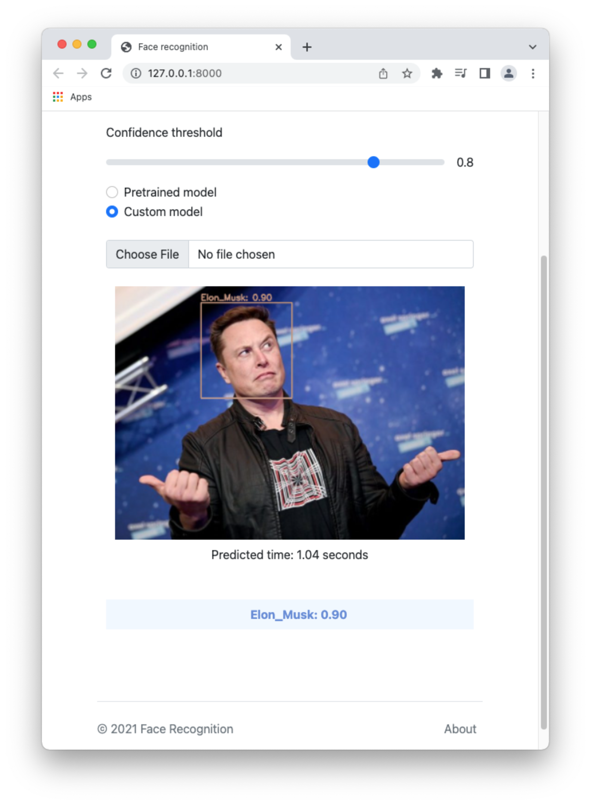

# CSC14005 Final Project
Face recognition website

## Team
- **`19127463` Nguyen Hoang Long**
  - **Email:** 19127463@student.hcmus.edu.vn

- **`19127355` Nguyen Duc Dat**
  - **Email:** 19127355@student.hcmus.edu.vn

## Description
To download the weights, run the script `download.sh` in the folder `darknet/weights/` before running the application. The first model are the default model of YOLOv3, which can recognize 80 types of objects in the COCO dataset, while the custom model, which can recognize the faces of five people, is the second model (Jeff Bezos, Bill Gates, Elon Musk, Larry Page, and Mark Zuckerberg).

After that, you need to install all dependencies and run the app by running these following commands.

```sh
pip install -r requirements.txt
gunicorn face_detection_web_app.wsgi
```

## User Interface of the website
